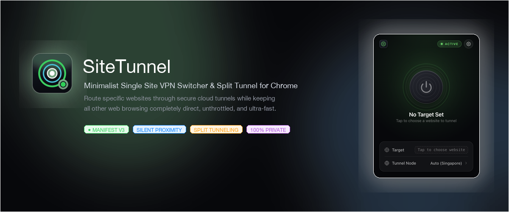
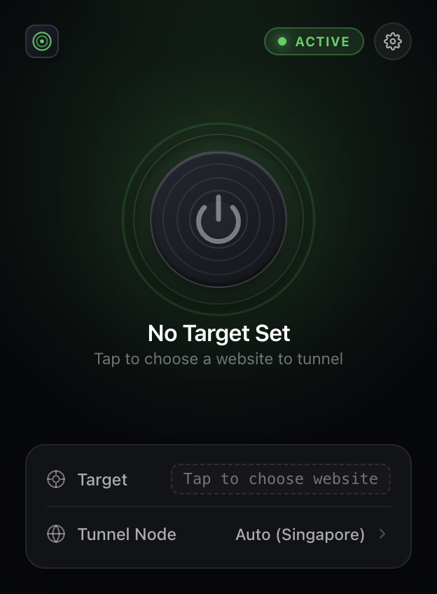
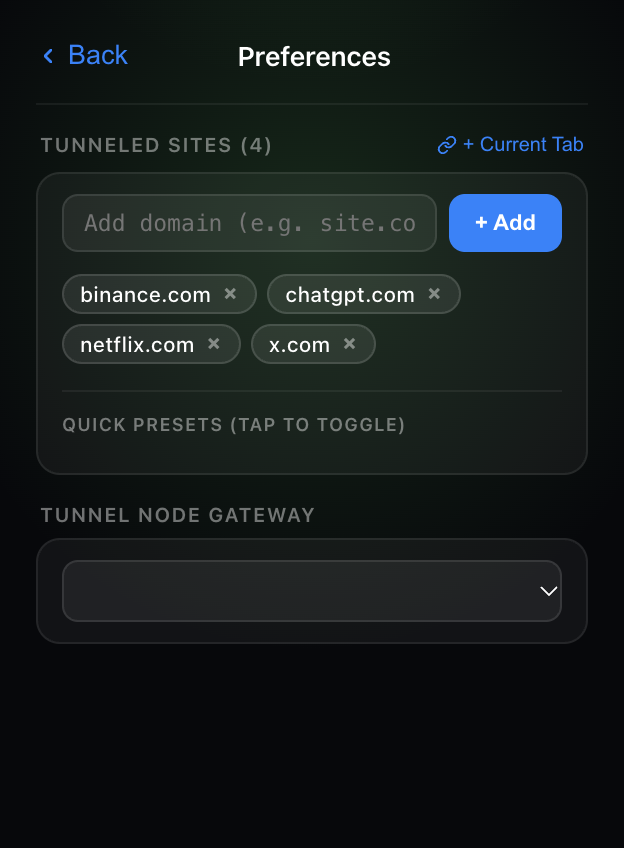
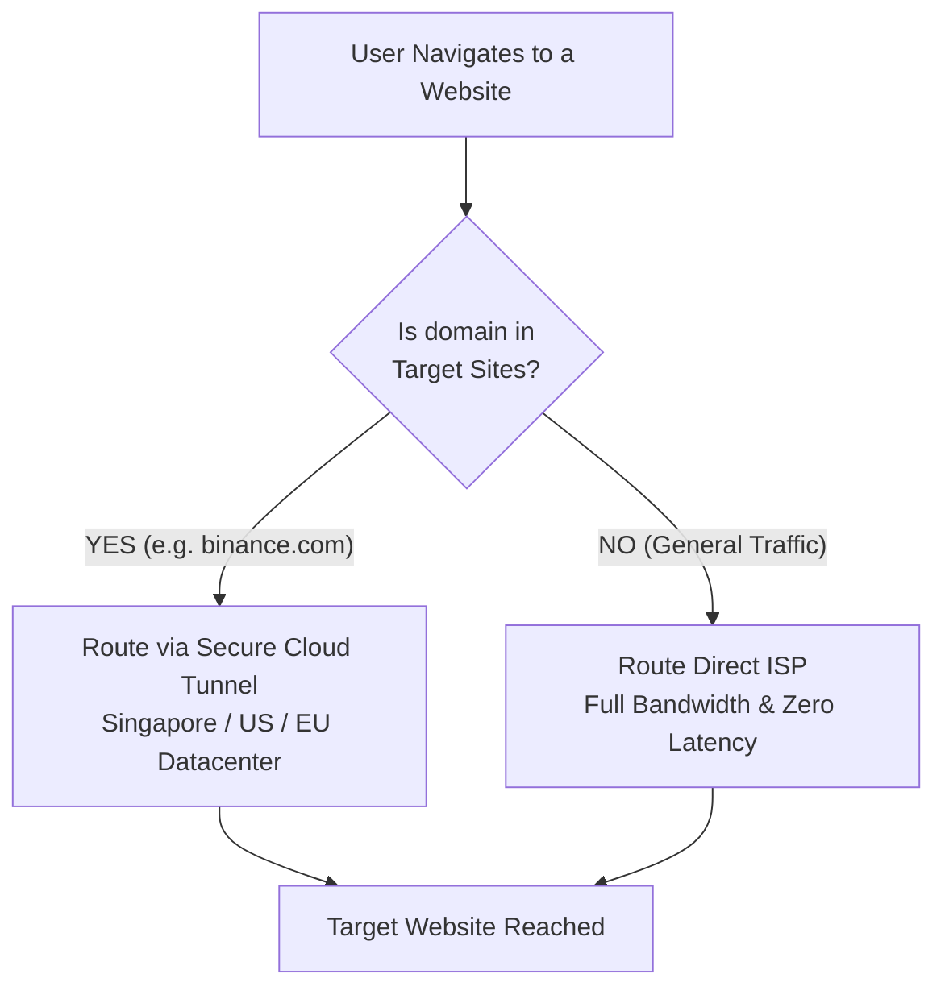

<p align="center">
  
</p>

<p align="center">
  <a href="https://developer.chrome.com/docs/extensions/mv3/intro/"></a>
  <a href="#-features"></a>
  <a href="#-privacy-first--zero-permissions-proximity"></a>
  <a href="#-license"></a>
</p>

<p align="center">
  <b>Route specific websites through secure cloud tunnels with one click. Clean, instant, and minimalist.</b><br>
  <i>Precision-engineered split-tunneling — keeping your regular web browsing direct, ultra-fast, and unthrottled.</i>
</p>

---

## ⚡ The Problem vs. The Solution

| Traditional VPN Extensions | SiteTunnel |
| :--- | :--- |
| ❌ Forces **100% of your web traffic** through proxy servers | ✅ **Split-tunnels only your selected domains**; all other sites stay direct |
| ❌ Drastically slows down downloads, YouTube, and local browsing | ✅ Zero overhead or throttling on non-target websites |
| ❌ Breaks banking, local streaming, and intranet sites | ✅ Normal sites see your real IP and native connection speed |
| ❌ Heavy background daemons, battery drain, and logins | ✅ Self-contained, lightweight, zero accounts, and zero signups |
| ❌ Intrusive location permission popups | ✅ **Silent Proximity**: automatically connects to the closest datacenter silently |

---

## 📸 Interface Preview

<p align="center">
  
  &nbsp;&nbsp;&nbsp;&nbsp;&nbsp;&nbsp;
  
</p>

<p align="center">
  <i>Left: Active secure tunnel state with halo wave pulse animation.<br>Right: Preferences slide-over sheet with multi-site tags, quick presets, and datacenter selector.</i>
</p>

---

## ✨ Features

- **Tactile Concentric Tunnel Portal**:
  Spring-animated power switch with precision tactile feedback (`scale(0.93)`), concentric perspective aperture rings, live **halo wave** ripple (`2.8s cubic-bezier`), and ambient green backlight diffusion.
- **Silent Proximity Routing (Zero Permission Prompts)**:
  On `Auto`, SiteTunnel dynamically routes through the geographically closest cloud datacenter (**Singapore**, **United States**, or **Europe**) without ever triggering intrusive browser `navigator.geolocation` permission dialogs.
- **Multi-Site Split Routing**:
  Manage multiple target domains simultaneously. Enter custom domains or pick from one-tap presets (**ChatGPT**, **Netflix**, **Binance**, **Reddit**, **X / Twitter**, **YouTube**).
- **1-Click "+ Current Tab"**:
  Quickly add the website open in your active browser tab with a single click.
- **Strict Target Enforcement**:
  On first launch or whenever no websites are configured, SiteTunnel refuses to proxy all traffic—it prompts you to choose the exact site you want to tunnel, safeguarding your normal browsing speed.
- **Custom Proxy Support**:
  Supports standard HTTP and SOCKS5 user proxies (`1.2.3.4:8080` or `socks5://...`).
- **Toolbar Status Badge**:
  Real-time vibrant green `ON` toolbar badge indicator whenever your tunnel is engaged.
- **100% Private & Local**:
  Zero analytics, zero telemetry, zero accounts. Operates purely client-side within Chrome via native PAC proxy routing.

---

## 🏗️ Architecture & How It Works



When you toggle SiteTunnel on, Chrome's native `chrome.proxy` API injects an isolated PAC (Proxy Auto-Config) script:

```javascript
function FindProxyForURL(url, host) {
  // Only route explicitly configured domains
  if (shExpMatch(host, "*binance.com*") || shExpMatch(host, "*chatgpt.com*")) {
    return "PROXY 4.144.146.21:80; DIRECT";
  }
  // All other web traffic bypasses the proxy completely
  return "DIRECT";
}
```

---

## 📁 Repository Structure

```text
sitetunnel/
├── manifest.json         # Manifest V3 extension definition
├── background.js         # Service worker & silent proximity locator
├── vpn_registry.js       # Cloud endpoints, timezone mapping & presets
├── popup.html            # Minimalist interface & preferences sheet
├── popup.js              # State controller & tactile interaction logic
├── make_logo.py          # 4x supersampled icon generator
├── assets/               # High-DPI banner & UI preview images
│   ├── banner.png
│   ├── preview_active.png
│   ├── preview_inactive.png
│   └── preview_preferences.png
├── icons/                # High-DPI extension icons (16px, 32px, 48px, 128px)
├── sitetunnel-v1.2.0.zip # Production-ready Chrome Web Store package
└── README.md             # Project documentation
```

---

## 🚀 Quick Start (Install Locally)

1. Clone or download this repository:
   ```bash
   git clone https://github.com/sitetunnel/sitetunnel.git
   ```
2. Open Google Chrome and navigate to:
   ```text
   chrome://extensions
   ```
3. Enable **Developer mode** toggle in the top-right corner.
4. Click **Load unpacked** (top-left) and select the `sitetunnel` folder.
5. Click the **SiteTunnel** icon in your Chrome toolbar to start tunneling!

---

## 🛒 Chrome Web Store Submission Kit

The ready-to-upload archive is pre-built at:
`sitetunnel-v1.2.0.zip`

### Submission Metadata

- **Title**: `SiteTunnel — Single Site VPN Switcher`
- **Short Name**: `SiteTunnel`
- **Category**: `Productivity` or `Privacy & Security`
- **Short Summary (95/132 chars)**:
  ```text
  Route specific websites through secure cloud tunnel with one click. Clean, instant, and minimalist.
  ```

### Permissions Justification (For Chrome Reviewers)
- **`proxy`**: Required to set PAC (Proxy Auto-Config) rules so only user-designated domains are routed through the cloud tunnel while all other web traffic remains direct.
- **`storage`**: Required to store user preferences locally (target domain list and preferred tunnel region).
- **`tabs`**: Required to capture the active tab's domain when the user clicks the "+ Current Tab" button.

---

## 🛡️ Privacy Policy

**SiteTunnel operates with a strict zero-telemetry policy:**
- **Zero Data Collection**: No logs, no telemetry, no tracking, and no external analytics.
- **Zero Account Requirement**: No signups, passwords, or emails.
- **No Location Tracking**: Silent proximity detection calculates the nearest datacenter locally from your timezone without ever accessing `navigator.geolocation`.
- **Local Storage Only**: Your list of tunneled websites is stored strictly in your browser's local `chrome.storage.local`.

---

## 📄 License

Distributed under the **MIT License**. See `LICENSE` for details.

Built with ❤️ using modern Chrome Extension Manifest V3 standards.
